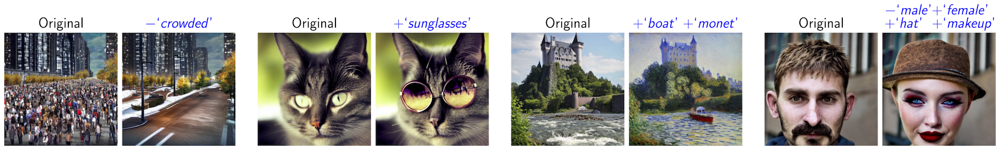

# Semantic Guidance for Diffusion

Official Implementation of the [Paper](https://arxiv.org/abs/2301.12247) **SEGA: Instructing Diffusion using Semantic Dimensions**. 

You may find the implementation of the previous [pre-print](http://arxiv.org/abs/2212.06013) **The Stable Artist: Interacting with Concepts in Diffusion Latent Space** under the tag [StableArtist](https://github.com/ml-research/semantic-image-editing/tree/StableArtist).

## Interactive Demo
An interactive demonstration is available in Colab and on Huggingface [](https://colab.research.google.com/github/ml-research/semantic-image-editing/blob/main/examples/SemanticGuidance.ipynb) [](https://huggingface.co/spaces/AIML-TUDA/semantic-diffusion)



## Installation
SEGA is fully integrated in the ```diffusers``` library as ```SemanticStableDiffusionPipeline```. Just install diffusers to use it:

```cmd
pip install diffusers
```

Alternatively you can clone this repository and install it locally by running

```cmd
git clone https://github.com/ml-research/semantic-image-editing.git
cd ./semantic-image-editing
pip install .
```
or install it directly from git
```cmd
pip install git+https://github.com/ml-research/semantic-image-editing.git
```

## Usage
This repository provides a new diffusion pipeline supporting semantic image editing based on the [diffusers](https://github.com/huggingface/diffusers) library.
The ```SemanticEditPipeline``` extends the ```StableDiffusionPipeline``` and can therefore be loaded from a stable diffusion checkpoint like shown below.


```python
from semdiffusers import SemanticEditPipeline
device='cuda'

pipe = SemanticEditPipeline.from_pretrained(
    "runwayml/stable-diffusion-v1-5",
).to(device)
```
or load the corresponding pipeline in diffusers:

```python 
from diffusers import SemanticStableDiffusionPipeline
device = 'cuda'
pipe = SemanticStableDiffusionPipeline.from_pretrained(
    "runwayml/stable-diffusion-v1-5",
).to(device)
```

An exemplary usage of the pipeline could look like this:
```python
import torch
gen = torch.Generator(device=device)

gen.manual_seed(21)
out = pipe(prompt='a photo of the face of a woman', generator=gen, num_images_per_prompt=1, guidance_scale=7,
           editing_prompt=['smiling, smile',       # Concepts to apply 
                           'glasses, wearing glasses', 
                           'curls, wavy hair, curly hair', 
                           'beard, full beard, mustache'],
           reverse_editing_direction=[False, False, False, False], # Direction of guidance i.e. increase all concepts
           edit_warmup_steps=[10, 10, 10,10], # Warmup period for each concept
           edit_guidance_scale=[4, 5, 5, 5.4], # Guidance scale for each concept
           edit_threshold=[0.99, 0.975, 0.925, 0.96], # Threshold for each concept. Threshold equals the percentile of the latent space that will be discarded. I.e. threshold=0.99 uses 1% of the latent dimensions
           edit_momentum_scale=0.3, # Momentum scale that will be added to the latent guidance
           edit_mom_beta=0.6, # Momentum beta
           edit_weights=[1,1,1,1,1] # Weights of the individual concepts against each other
          )
images = out.images

```

## Citation
If you like or use our work please cite us:
```bibtex
@article{brack2023Sega,
      title={SEGA: Instructing Diffusion using Semantic Dimensions}, 
      author={Manuel Brack and Felix Friedrich and Dominik Hintersdorf and Lukas Struppek and Patrick Schramowski and Kristian Kersting},
      year={2023},
      journal={NeurIPS}
}
```

